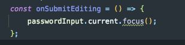

## animation
- decay : 초기속도로 시작해서 느려짐
- spring : 물리모델 사용이가 
- timing : 


```
- ref를 통한 value값 보존
  const Y = useRef(new Animated.Value(0)).current; 
```


### firebase 사용

#### SHA-1
- cd android
- cd ./gradlew signingReport


## IOS
-

- 설정
- npx pod-install
- npm run ios
- [참고]('https://rnfirebase.io/')


### 공부 내용
- Appstore 에서는 다른 소셜로그인을 넣을 경우 무조건 <strong>애플 로그인</strong> 넣어야한다
- ios 애뮬레이터에서 키보드가 안나올 경우 => command + 화살표위로 + K
- 다음 칸으로 이동되는 함수



- keyboard Props
```
   autoCapitalize='none' //첫 글자 자동대문자
   autoCorrect={false} //자동 수정
   keyboardType='email-address'
   value={email}
   returnKeyType='next' //ios   다음 버튼 단어
   // returnKeyLabel  android
```
