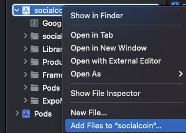

## animation
- decay : 초기속도로 시작해서 느려짐
- spring : 물리모델 사용이가 
- timing : 


```
- ref를 통한 value값 보존
  const Y = useRef(new Animated.Value(0)).current; 
```


### firebase 사용

#### SHA-1
- cd android
- cd ./gradlew signingReport


## IOS
-

- 설정
- npx pod-install
- npm run ios
- [참고]('https://rnfirebase.io/')
